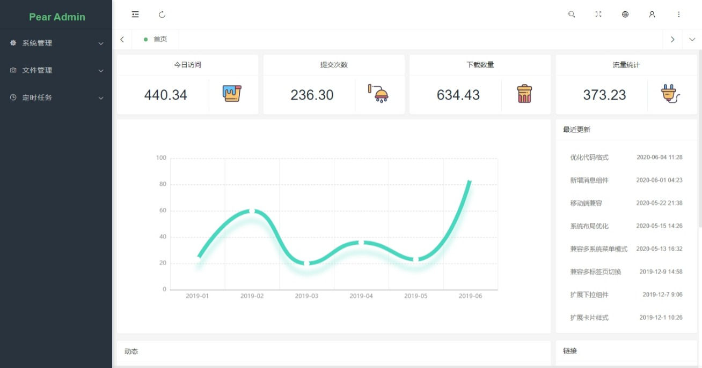
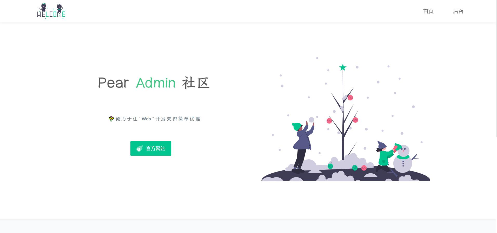
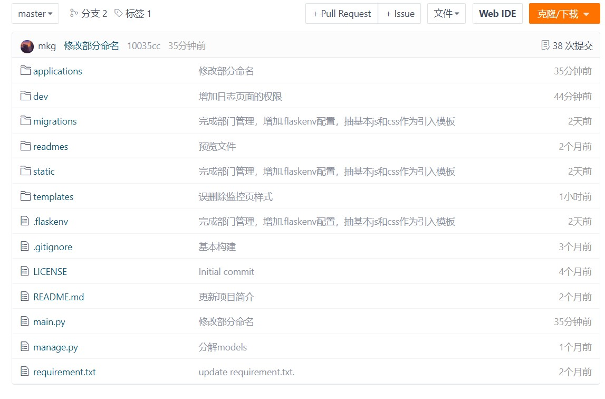

## 项目介绍  :id=start

欢迎阅读 CTC Speech System 的开发文档！CTC Speech Flask 是一个基于 Flask 的语音识别系统，拥抱应用广泛的 Python 语言，通过使用本系统，即可快速体验语音技术。

项目旨在为语音学习者提供一个语音系统，成为您学习语音识别、体验语音合成、以及开发语音系统的工具。

同时，CTC Speech System 项目也是一个对于语音技术的初学者友好的项目。此项目处于开发阶段，欢迎各位语音技术爱好者加入到CTC Speech System项目建设中来。如果您在使用此项目的过程中，发现项目代码存在问题，请在 Github 上提交 PR ，一起开源共建！

接下来，我们将会为您详细介绍该项目搭建方法与开发架构。

> 如果对项目有不理解的地方欢迎加入我们的讨论群。

> 微信群不定期在qq群更新二维码。

**[master分支版本](https://gitee.com/pear-admin/pear-admin-flask/tree/master/)**

flask 2.0.1 +	flask-sqlalchemy + 权限验证 + Flask-APScheduler 定时任务 + marshmallow 序列化与数据验证

master 分支为主分支，是功能最全、页面最多的分支。

## 下载使用  :id=download

#### 1. 官网地址

官网提供稳定版本的 Release 发行版本 [前往](http://www.pearadmin.com)

#### 2. 源码仓库

如果你需要最新代码，请前往 Gitee 仓库 [前往](https://gitee.com/pear-admin/pear-admin-flask)

如果您完成了这一步，请参阅[下载安装](install.md)章节。

